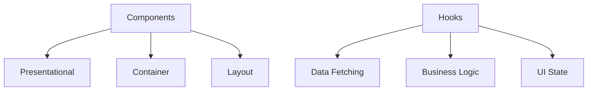
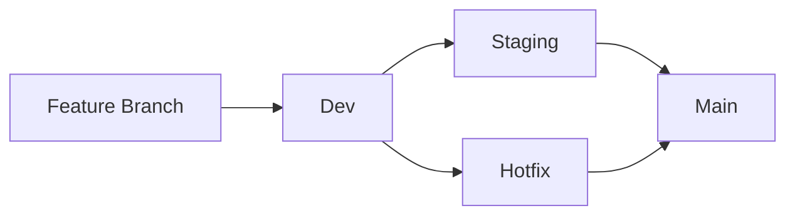
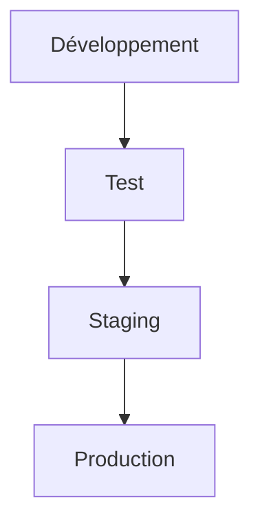

# Plan Qualité Logiciel (SQP) - KAP

## 1. Objectifs Qualité

### 1.1 Métriques Clés
```typescript
interface QualityMetrics {
  codeCoverage: number;        // > 80%
  bugFrequency: number;        // < 2/mois
  userSatisfaction: number;    // > 4.5/5
  performanceScore: number;    // > 90/100
}
```

### 1.2 Standards de Code
```typescript
// Exemple de configuration ESLint
module.exports = {
  extends: [
    'eslint:recommended',
    'plugin:@typescript-eslint/recommended',
    'plugin:react-hooks/recommended'
  ],
  rules: {
    'no-console': 'warn',
    'no-unused-vars': 'error',
    '@typescript-eslint/explicit-function-return-type': 'error'
  }
}
```

## 2. Structure du Code

### 2.1 Architecture


### 2.2 Organisation
```
src/
├── components/       # Composants React
├── hooks/           # Hooks personnalisés
├── utils/           # Utilitaires
├── types/           # Types TypeScript
├── api/             # Intégration API
└── styles/          # Styles Tailwind
```

## 3. Processus de Développement

### 3.1 Git Workflow


### 3.2 Revue de Code
```typescript
interface CodeReviewChecklist {
  typeChecks: boolean;
  testCoverage: boolean;
  performanceImpact: boolean;
  securityConsiderations: boolean;
  documentation: boolean;
}
```

## 4. Standards de Test

### 4.1 Tests Unitaires
```typescript
// Exemple de test
describe('SessionForm', () => {
  it('validates required fields', () => {
    render(<SessionForm />)
    fireEvent.click(screen.getByText('Submit'))
    expect(screen.getByText('Title is required')).toBeInTheDocument()
  })
})
```

### 4.2 Tests d'Intégration
```typescript
describe('Session Creation Flow', () => {
  it('creates a complete session', async () => {
    const session = await createSession(mockData)
    expect(session).toHaveProperty('id')
    expect(session.sequences).toHaveLength(3)
  })
})
```

## 5. Documentation

### 5.1 Code
```typescript
/**
 * Gère la création et la modification d'une séance
 * @param initialData - Données initiales de la séance
 * @returns Objet contenant les méthodes de gestion du formulaire
 */
export const useSessionForm = (initialData?: SessionData): SessionFormHook => {
  // Implementation
}
```

### 5.2 API
```typescript
interface APIDocumentation {
  endpoint: string;
  method: 'GET' | 'POST' | 'PUT' | 'DELETE';
  parameters: Parameter[];
  responses: Response[];
  examples: Example[];
}
```

## 6. Performance

### 6.1 Métriques Frontend
```typescript
interface FrontendMetrics {
  firstPaint: number;        // < 1.5s
  timeToInteractive: number; // < 2.5s
  bundleSize: number;        // < 200KB
  memoryUsage: number;       // < 50MB
}
```

### 6.2 Optimisations
```typescript
// Exemple d'optimisation
const OptimizedImage = memo(({ src, alt }: ImageProps) => (
  
))
```

## 7. Sécurité

### 7.1 Authentification
```typescript
interface SecurityChecks {
  jwt: boolean;
  csrf: boolean;
  xss: boolean;
  sqlInjection: boolean;
}
```

### 7.2 Autorisation
```typescript
const checkPermissions = (
  user: User,
  resource: Resource,
  action: Action
): boolean => {
  // Implementation des vérifications
}
```

## 8. Monitoring

### 8.1 Logs Applicatifs
```typescript
interface LogEntry {
  timestamp: Date;
  level: 'info' | 'warn' | 'error';
  module: string;
  message: string;
  context: Record<string, unknown>;
}
```

### 8.2 Alertes
```typescript
interface Alert {
  type: 'performance' | 'error' | 'security';
  threshold: number;
  action: () => void;
}
```

## 9. Accessibilité

### 9.1 Standards WCAG
- Navigation clavier
- Support lecteur d'écran
- Contraste des couleurs
- Structure sémantique

### 9.2 Tests
```typescript
describe('Accessibility', () => {
  it('meets WCAG 2.1 guidelines', async () => {
    const results = await axe(component)
    expect(results.violations).toHaveLength(0)
  })
})
```

## 10. CI/CD

### 10.1 Pipeline
```yaml
stages:
  - lint
  - test
  - build
  - deploy

lint:
  script:
    - npm run lint
    - npm run type-check

test:
  script:
    - npm run test:unit
    - npm run test:integration

build:
  script:
    - npm run build
    
deploy:
  script:
    - npm run deploy
```

### 10.2 Environnements


## 11. Maintenance

### 11.1 Dette Technique
```typescript
interface TechnicalDebt {
  type: 'code' | 'test' | 'doc' | 'security';
  severity: 'low' | 'medium' | 'high';
  estimated_effort: number;
  impact: string;
}
```

### 11.2 Mises à Jour
- Dépendances NPM
- Sécurité
- Framework
- Tests

## 12. Support

### 12.1 Documentation
- Guides utilisateur
- Documentation API
- Guides développeur
- Procédures déploiement

### 12.2 Formation
- Onboarding développeurs
- Bonnes pratiques
- Sécurité
- Performance
