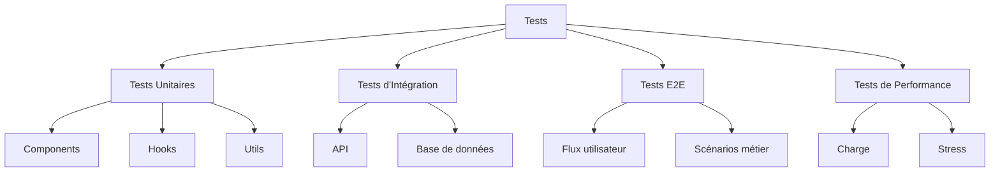
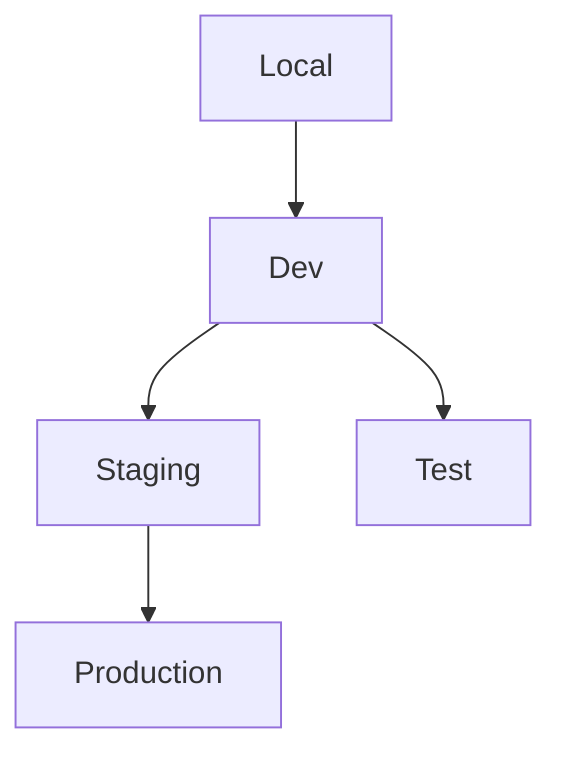

# Plan de Test Logiciel (STP) - KAP

## 1. Objectifs et Portée

### 1.1 Objectifs Principaux
- Validation fonctionnelle complète
- Tests de performance et charge
- Tests d'intégration des composants
- Validation de l'expérience utilisateur
- Tests de sécurité et conformité

### 1.2 Critères de Succès
```typescript
interface TestSuccess {
  unitTestCoverage: number;     // > 80%
  e2eTestsPassing: number;      // 100%
  performanceScore: number;     // > 90
  securityScore: number;        // > 95
  accessibilityScore: number;   // > 90
}
```

## 2. Stratégie de Test

### 2.1 Types de Tests


### 2.2 Niveaux de Test
1. **Niveau Unitaire**
   - Composants React isolés
   - Hooks personnalisés
   - Fonctions utilitaires
   - Services API

2. **Niveau Intégration**
   - Flux de données complets
   - Interactions composants
   - API Supabase
   - Gestion d'état

3. **Niveau Système**
   - Tests E2E
   - Performance globale
   - Sécurité système
   - UX/UI complète

## 3. Tests Unitaires

### 3.1 Composants React
```typescript
// Example de test de composant
import { render, screen } from '@testing-library/react'
import { SessionForm } from '../components/SessionForm'

describe('SessionForm', () => {
  it('validates required fields', async () => {
    render(<SessionForm />)
    
    // Test implementation
    const submitButton = screen.getByRole('button', { name: /save/i })
    await userEvent.click(submitButton)
    
    expect(screen.getByText(/title is required/i)).toBeInTheDocument()
  })
})
```

### 3.2 Hooks Personnalisés
```typescript
// Example de test de hook
import { renderHook } from '@testing-library/react-hooks'
import { useSessionForm } from '../hooks/useSessionForm'

describe('useSessionForm', () => {
  it('handles form submission correctly', () => {
    const { result } = renderHook(() => useSessionForm())
    
    // Test implementation
    act(() => {
      result.current.handleSubmit(mockData)
    })
    
    expect(result.current.isSubmitting).toBe(false)
  })
})
```

## 4. Tests d'Intégration

### 4.1 API et Base de Données
```typescript
describe('Session API Integration', () => {
  it('creates and retrieves a session', async () => {
    // Create session
    const session = await createSession(mockSessionData)
    
    // Verify creation
    const retrieved = await getSession(session.id)
    expect(retrieved).toEqual(session)
    
    // Clean up
    await deleteSession(session.id)
  })
})
```

### 4.2 Tests de Flux
```typescript
describe('Session Creation Flow', () => {
  it('completes full creation process', async () => {
    // Login
    await loginUser(testUser)
    
    // Navigate to form
    await navigateToSessionForm()
    
    // Fill and submit form
    await fillSessionForm(testSessionData)
    await submitForm()
    
    // Verify success
    expect(await isSessionCreated()).toBe(true)
  })
})
```

## 5. Tests End-to-End

### 5.1 Configuration Cypress
```typescript
// cypress/e2e/session-management.cy.ts
describe('Session Management', () => {
  beforeEach(() => {
    cy.login(Cypress.env('TEST_USER'))
  })

  it('creates a new session', () => {
    cy.visit('/sessions/new')
    cy.get('[data-testid="title-input"]').type('Test Session')
    cy.get('[data-testid="submit-button"]').click()
    cy.url().should('include', '/sessions/')
  })
})
```

### 5.2 Scénarios Critiques
1. **Création et Édition de Séance**
   - Création complète
   - Modification des champs
   - Validation des règles
   - Sauvegarde et publication

2. **Gestion des Séquences**
   - Ajout de séquences
   - Réorganisation
   - Suppression
   - Validation des objectifs

## 6. Tests de Performance

### 6.1 Métriques
```typescript
interface PerformanceMetrics {
  loadTime: number;         // < 2s
  firstPaint: number;      // < 1.5s
  ttfb: number;           // < 200ms
  interactiveTime: number; // < 3s
}
```

### 6.2 Scénarios de Charge
- 100 utilisateurs simultanés
- 1000 requêtes/minute
- 10MB de données uploadées
- 50 sessions créées/minute

## 7. Tests de Sécurité

### 7.1 Authentification
```typescript
describe('Authentication Security', () => {
  it('prevents unauthorized access', async () => {
    // Test implementation
  })

  it('handles invalid tokens', async () => {
    // Test implementation
  })
})
```

### 7.2 Autorisation
```typescript
describe('Authorization Checks', () => {
  it('restricts access by role', async () => {
    // Test implementation
  })

  it('validates resource ownership', async () => {
    // Test implementation
  })
})
```

## 8. Tests d'Accessibilité

### 8.1 Standards WCAG
- Navigation clavier
- Support lecteur d'écran
- Contraste des couleurs
- Structure sémantique

### 8.2 Tests Automatisés
```typescript
describe('Accessibility', () => {
  it('meets WCAG 2.1 standards', async () => {
    const results = await axe(container)
    expect(results.violations).toHaveLength(0)
  })
})
```

## 9. Environnements de Test

### 9.1 Configuration


### 9.2 Données de Test
- Jeux de données réalistes
- Données de performance
- Cas limites
- Scénarios d'erreur

## 10. Rapports et Métriques

### 10.1 Couverture
```typescript
interface CoverageReport {
  statements: number;    // > 80%
  branches: number;      // > 75%
  functions: number;     // > 85%
  lines: number;        // > 80%
}
```

### 10.2 Documentation
- Plans de test détaillés
- Rapports d'exécution
- Bugs et résolutions
- Métriques de qualité

## 11. Automatisation

### 11.1 CI/CD
```yaml
test:
  script:
    - npm run test:unit
    - npm run test:integration
    - npm run test:e2e
    - npm run test:performance
```

### 11.2 Outils
- Jest pour tests unitaires
- Cypress pour E2E
- k6 pour performance
- axe pour accessibilité

## 12. Maintenance

### 12.1 Mise à Jour
- Revue régulière des tests
- Mise à jour des scénarios
- Optimisation des performances
- Documentation continue

### 12.2 Support
- Debugging des tests
- Formation équipe
- Amélioration continue
- Revue de code
