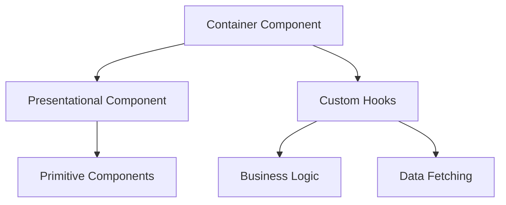

# Design des Composants - KAP

## 1. Principes de Design

### 1.1 Architecture des Composants
La structure des composants suit une approche modulaire et hiérarchique.

### 1.2 Patterns Principaux


## 2. Structure des Composants

### 2.1 Types de Composants
```typescript
// Composant Container
interface ContainerProps {
  data: any;
  loading: boolean;
  error: Error | null;
  onAction: () => void;
}

// Composant Presentational
interface PresentationalProps {
  items: Item[];
  onSelect: (item: Item) => void;
}

// Composant Generic
interface GenericProps<T> {
  value: T;
  onChange: (value: T) => void;
}
```

### 2.2 Organisation des Dossiers
```
components/
├── common/          # Composants réutilisables
├── layouts/         # Layouts de page
├── features/        # Composants spécifiques
├── ui/             # Composants UI de base
└── forms/          # Composants de formulaire
```

## 3. Patterns d'Implémentation

### 3.1 Container Pattern
```typescript
const SessionContainer = () => {
  const { data, isLoading } = useSessionData();
  return <SessionView data={data} loading={isLoading} />;
};
```

### 3.2 Render Props Pattern
```typescript
interface RenderProps {
  render: (data: any) => React.ReactNode;
}

const DataProvider = ({ render }: RenderProps) => {
  const data = useData();
  return render(data);
};
```

### 3.3 Compound Components
```typescript
const Select = {
  Root: ({ children }: PropsWithChildren) => {...},
  Option: ({ value, label }: OptionProps) => {...},
  Group: ({ label, children }: GroupProps) => {...}
};
```

## 4. Hooks Personnalisés

### 4.1 Structure
```typescript
const useCustomHook = (config: Config): Result => {
  const [state, setState] = useState<State>(initialState);
  
  useEffect(() => {
    // Side effects
  }, [dependencies]);
  
  return {
    state,
    actions: {
      update: () => void,
      reset: () => void
    }
  };
};
```

### 4.2 Exemples Courants
```typescript
// Gestion de formulaire
const useForm = <T>(initialValues: T) => {...};

// Gestion de données
const useData = (query: Query) => {...};

// Gestion d'état UI
const useUIState = (config: UIConfig) => {...};
```

## 5. Gestion d'État

### 5.1 Local State
```typescript
const [state, setState] = useState<State>(initialState);

const updateState = (newData: Partial<State>) => {
  setState(prev => ({
    ...prev,
    ...newData
  }));
};
```

### 5.2 Global State
```typescript
interface GlobalState {
  user: User | null;
  settings: Settings;
  theme: Theme;
}

const useGlobalState = () => {
  // Implementation
};
```

## 6. Patterns de Rendu

### 6.1 Conditional Rendering
```typescript
const ConditionalComponent = ({ condition, children }) => {
  if (!condition) return null;
  return <>{children}</>;
};
```

### 6.2 List Rendering
```typescript
const ListView = ({ items }: { items: Item[] }) => (
  <ul>
    {items.map(item => (
      <ListItem key={item.id} {...item} />
    ))}
  </ul>
);
```

## 7. Gestion des Formulaires

### 7.1 Structure
```typescript
const Form = {
  Root: ({ onSubmit }: FormProps) => {...},
  Field: ({ name, label }: FieldProps) => {...},
  Submit: ({ text }: SubmitProps) => {...}
};
```

### 7.2 Validation
```typescript
interface ValidationRules {
  required?: boolean;
  pattern?: RegExp;
  custom?: (value: any) => boolean;
}

const useValidation = (rules: ValidationRules) => {...};
```

## 8. Accessibilité

### 8.1 Standards
- ARIA labels
- Keyboard navigation
- Focus management
- Screen reader support

### 8.2 Implémentation
```typescript
const AccessibleButton = ({
  label,
  onClick
}: AccessibleButtonProps) => (
  <button
    aria-label={label}
    onClick={onClick}
    role="button"
    tabIndex={0}
  >
    {label}
  </button>
);
```

## 9. Tests

### 9.1 Tests Unitaires
```typescript
describe('Component', () => {
  it('should render correctly', () => {
    render(<Component />);
    expect(screen.getByRole('button')).toBeInTheDocument();
  });
});
```

### 9.2 Tests d'Intégration
```typescript
describe('Form', () => {
  it('should handle submission', async () => {
    const onSubmit = jest.fn();
    render(<Form onSubmit={onSubmit} />);
    
    // Test implementation
  });
});
```

## 10. Performance

### 10.1 Optimisations
- Memoization
- Lazy loading
- Code splitting
- Bundle optimization

### 10.2 Métriques
```typescript
interface PerformanceMetrics {
  renderTime: number;
  rerendersCount: number;
  memoryUsage: number;
}
```

## 11. Documentation

### 11.1 Storybook
```typescript
export default {
  title: 'Components/Button',
  component: Button,
  args: {
    variant: 'primary'
  }
} as ComponentMeta<typeof Button>;
```

### 11.2 JSDoc
```typescript
/**
 * @component
 * @example
 * <Button variant="primary">Click me</Button>
 */
```

## 12. Guidelines de Development

### 12.1 Bonnes Pratiques
- Single Responsibility
- DRY (Don't Repeat Yourself)
- KISS (Keep It Simple, Stupid)
- Composition over Inheritance

### 12.2 Style Guide
```typescript
// Naming conventions
const ButtonComponent = () => {...}    // Components
const useCustomHook = () => {...}      // Hooks
const handleClick = () => {...}        // Event handlers
```

