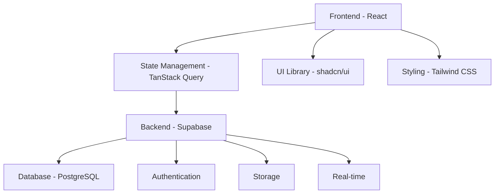
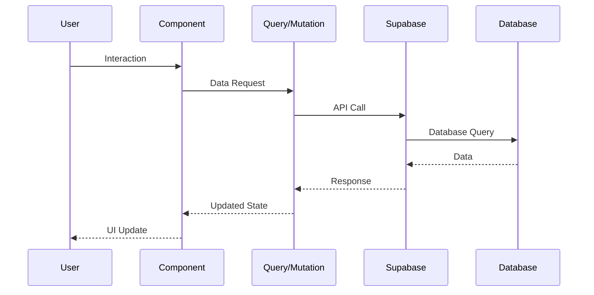
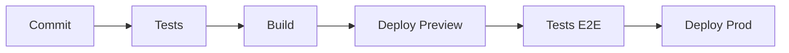

# Vue d'ensemble de l'Architecture - KAP

## 1. Introduction

### 1.1 Objectif
KAP est une application web moderne conçue pour permettre aux entraîneurs sportifs de créer, gérer et partager des séances d'entraînement de manière efficace et intuitive.

### 1.2 Principes Architecturaux
- Architecture orientée composants
- Séparation claire des responsabilités
- Modularité et réutilisabilité
- Scalabilité horizontale
- Performance optimale

## 2. Architecture Technique

### 2.1 Stack Technologique


### 2.2 Composants Principaux

#### Frontend
- React 18+ avec TypeScript
- TanStack Query pour la gestion d'état
- Tailwind CSS pour le styling
- Framer Motion pour les animations
- shadcn/ui pour les composants UI

#### Backend (Supabase)
- PostgreSQL pour le stockage
- Authentication JWT
- Storage pour les médias
- Real-time subscriptions
- Row Level Security

## 3. Structure du Projet

### 3.1 Organisation des Dossiers
```
src/
├── components/       # Composants réutilisables
├── pages/           # Pages de l'application
├── hooks/           # Hooks personnalisés
├── utils/           # Utilitaires
├── types/           # Types TypeScript
├── styles/          # Styles globaux
└── integrations/    # Intégrations externes
```

### 3.2 Flux de Données


## 4. Modules du Système

### 4.1 Module d'Authentification
- Gestion des sessions
- Contrôle d'accès
- Sécurité des tokens
- Refresh automatique

### 4.2 Module de Sessions
- Création/édition de séances
- Gestion des séquences
- Configuration des exercices
- Templates et présets

### 4.3 Module de Collaboration
- Partage de séances
- Commentaires et feedback
- Historique des modifications
- Notifications temps réel

## 5. Sécurité

### 5.1 Authentification
- JWT sécurisés
- Refresh tokens
- Session management
- 2FA (prévu)

### 5.2 Autorisation
```typescript
interface RolePermissions {
  create_session: boolean;
  edit_session: boolean;
  delete_session: boolean;
  share_session: boolean;
}

type UserRole = 'admin' | 'coach' | 'viewer';
```

### 5.3 Sécurité des Données
- Chiffrement en transit
- Backup automatiques
- Audit logs
- Sanitization des inputs

## 6. Performance

### 6.1 Stratégies d'Optimisation
- Code splitting
- Lazy loading
- Caching intelligent
- Compression des assets
- Optimisation des images

### 6.2 Métriques Clés
```typescript
interface PerformanceMetrics {
  firstPaint: number;        // < 1.5s
  firstContentfulPaint: number; // < 2s
  timeToInteractive: number;    // < 3s
  largestContentfulPaint: number; // < 2.5s
}
```

## 7. Monitoring

### 7.1 Logging
- Erreurs applicatives
- Performances utilisateur
- Utilisation des ressources
- Audit de sécurité

### 7.2 Alerting
- Seuils de performance
- Erreurs critiques
- Problèmes de sécurité
- Disponibilité système

## 8. Scalabilité

### 8.1 Horizontale
- Load balancing
- Caching distribué
- Réplication de données
- Sharding (si nécessaire)

### 8.2 Verticale
- Optimisation des requêtes
- Indexation intelligente
- Gestion des ressources
- Configuration serveur

## 9. Déploiement

### 9.1 Environnements
- Développement
- Staging
- Production
- Preview (PR)

### 9.2 CI/CD


## 10. Tests

### 10.1 Types de Tests
- Tests unitaires (Jest)
- Tests d'intégration
- Tests E2E (Cypress)
- Tests de performance

### 10.2 Couverture
```typescript
interface TestCoverage {
  statements: number; // > 80%
  branches: number;   // > 75%
  functions: number;  // > 85%
  lines: number;      // > 80%
}
```

## 11. Documentation

### 11.1 Documentation Technique
- Architecture
- API
- Base de données
- Déploiement

### 11.2 Documentation Utilisateur
- Guides d'utilisation
- Tutoriels
- FAQ
- Troubleshooting

## 12. Roadmap Technique

### 12.1 Court Terme
- Optimisation des performances
- Amélioration de la couverture de tests
- Implémentation de nouvelles fonctionnalités

### 12.2 Long Terme
- Migration vers une architecture micro-services
- Amélioration du système de cache
- Implementation de l'IA pour les recommandations
- Support multi-langues

