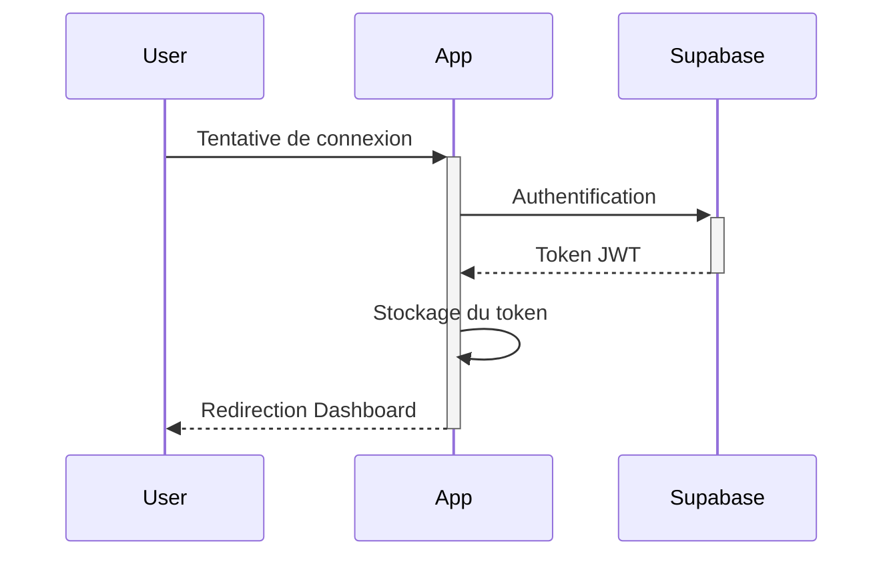

# Documentation de l'Authentification

## Vue d'ensemble
Le système d'authentification utilise Supabase pour gérer les sessions utilisateur de manière sécurisée.

## Composants d'Authentification

### 1. Formulaire de Connexion
```typescript
import { supabase } from "@/integrations/supabase/client"
import { Button } from "@/components/ui/button"

const LoginForm = () => {
  const handleLogin = async (email: string, password: string) => {
    const { data, error } = await supabase.auth.signInWithPassword({
      email,
      password,
    })
    // Gestion de la réponse...
  }
}
```

### 2. Gestion des Sessions
- Vérification automatique de l'état de connexion
- Rafraîchissement des tokens
- Déconnexion sécurisée

### 3. Protection des Routes
```typescript
const ProtectedRoute = ({ children }: { children: React.ReactNode }) => {
  const { session, loading } = useAuthCheck()
  
  if (loading) return <LoadingSpinner />
  if (!session) return <Navigate to="/auth" />
  
  return <>{children}</>
}
```

## Workflow d'Authentification



## Bonnes Pratiques
1. Validation des entrées
2. Gestion des erreurs
3. Sessions sécurisées
4. Tokens et refresh tokens

