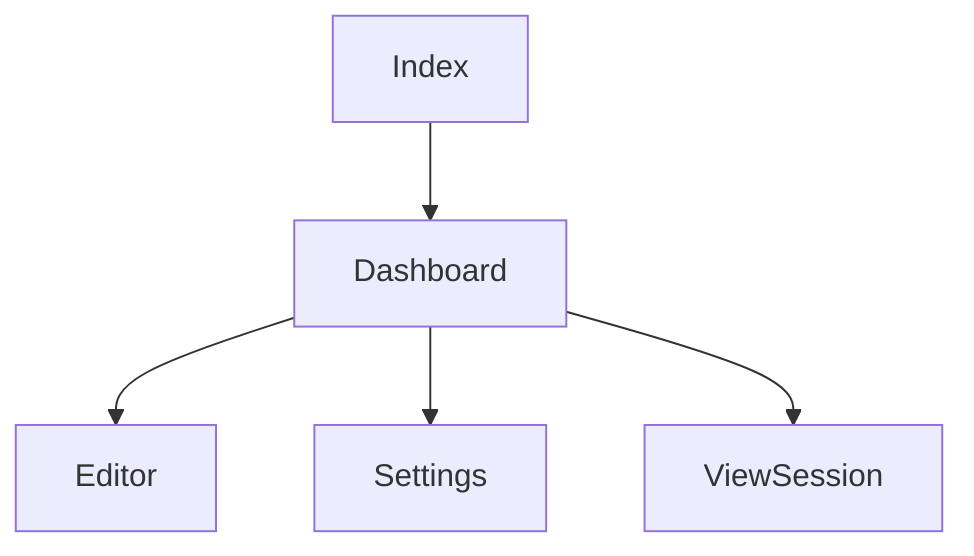

# Documentation des Pages

## Vue d'ensemble
Ce document décrit l'architecture et l'utilisation des composants de pages dans l'application.

### Pages Principales

1. **Page d'accueil (Index)**
   - Point d'entrée de l'application
   - Présentation des fonctionnalités principales
   - Composants : Hero, Features, Footer

2. **Dashboard**
   - Vue d'ensemble des séances
   - Liste des séances récentes
   - Actions rapides (créer, modifier, supprimer)

3. **Éditeur (Editor)**
   - Interface de création/modification de séances
   - Gestion des séquences et exercices
   - Configuration des objectifs
   - Prévisualisation en temps réel

4. **Paramètres (Settings)**
   - Configuration de l'application
   - Gestion des préférences utilisateur
   - Administration des données de référence

## Structure des Pages

## Points d'Attention
1. Gestion de l'état global
2. Navigation et routing
3. Optimisation des performances
4. Gestion des erreurs
5. Responsive design

