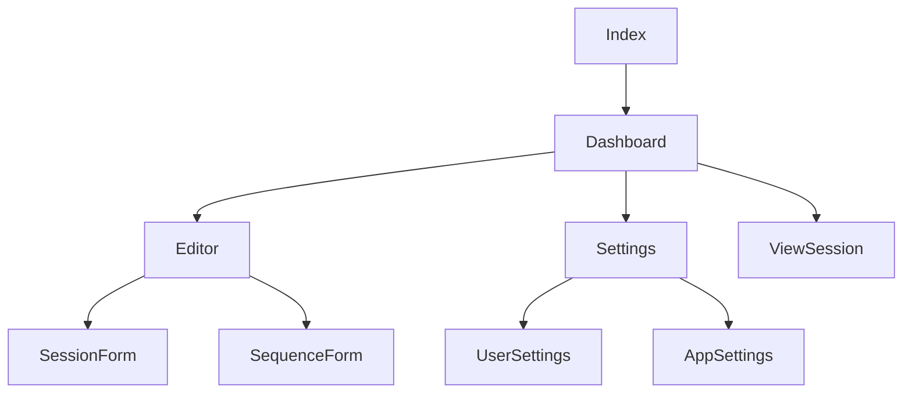
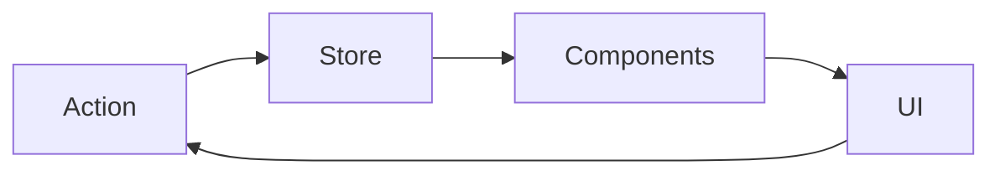

# Documentation des Pages

## Structure Globale de l'Application

### Hiérarchie des Pages


## Pages Principales

### 1. Page d'Accueil (Index)
Porte d'entrée de l'application, présente les fonctionnalités clés.

#### Composants
- `Hero` : Bannière principale
- `Features` : Liste des fonctionnalités
- `Footer` : Pied de page

#### Props et État
```typescript
interface HeroProps {
  title: string;
  description: string;
  ctaText: string;
}
```

### 2. Dashboard (/dashboard)
Centre de contrôle utilisateur présentant une vue d'ensemble des séances.

#### Fonctionnalités
- Liste des séances récentes
- Statistiques d'utilisation
- Actions rapides
- Filtres et recherche

#### État Global
```typescript
interface DashboardState {
  sessions: Session[];
  filters: FilterOptions;
  sortOrder: 'asc' | 'desc';
  view: 'grid' | 'list';
}
```

### 3. Éditeur (/editor)
Interface principale de création et modification des séances.

#### Structure
- Barre d'outils supérieure
- Panneau latéral de propriétés
- Zone d'édition principale
- Timeline des séquences

#### Gestion d'État
```typescript
interface EditorState {
  session: Session;
  selectedSequence?: Sequence;
  isDirty: boolean;
  history: HistoryState[];
}
```

### 4. Paramètres (/settings)
Configuration de l'application et préférences utilisateur.

#### Sections
- Profil utilisateur
- Préférences d'affichage
- Configuration des sports
- Gestion des templates

## Navigation

### Système de Routing
```typescript
const router = createBrowserRouter([
  {
    path: "/",
    element: <Index />,
  },
  {
    path: "/dashboard",
    element: <Dashboard />,
  },
  {
    path: "/editor/:id",
    element: <Editor />,
  },
  // ... autres routes
]);
```

### Gestion des URLs
- URLs descriptives
- Paramètres d'URL pour filtres
- Gestion de l'historique
- Navigation programmative

## Gestion d'État Global

### Structure de l'État
```typescript
interface AppState {
  user: User;
  settings: AppSettings;
  notifications: Notification[];
  currentSession?: Session;
}
```

### Flux de Données


## Authentification et Autorisation

### Flux d'Authentification
1. Vérification du token
2. Redirection si nécessaire
3. Chargement des données utilisateur
4. Mise à jour du contexte

### Protection des Routes
```typescript
const ProtectedRoute = ({ children }) => {
  const { isAuthenticated } = useAuth();
  if (!isAuthenticated) return <Navigate to="/login" />;
  return children;
};
```

## Optimisation des Performances

### Stratégies
1. Code splitting par route
2. Lazy loading des composants
3. Mise en cache des données
4. Optimisation des images

### Métriques Clés
- First Paint < 1.5s
- Time to Interactive < 2.5s
- First Input Delay < 100ms

## Gestion des Erreurs

### Types d'Erreurs
- Erreurs de réseau
- Erreurs d'authentification
- Erreurs de validation
- Erreurs système

### Traitement
```typescript
const ErrorBoundary = ({
  error,
  resetErrorBoundary,
}: {
  error: Error;
  resetErrorBoundary: () => void;
}) => {
  return (
    <div role="alert">
      <p>Une erreur est survenue:</p>
      <pre>{error.message}</pre>
      <button onClick={resetErrorBoundary}>Réessayer</button>
    </div>
  );
};
```

## Responsive Design

### Breakpoints
```typescript
const breakpoints = {
  sm: '640px',
  md: '768px',
  lg: '1024px',
  xl: '1280px',
  '2xl': '1536px',
};
```

### Stratégies
- Mobile-first approach
- Composants adaptatifs
- Layout fluide
- Images responsives

## Tests

### Tests E2E
```typescript
describe('Navigation', () => {
  it('should navigate through main pages', () => {
    cy.visit('/');
    cy.get('[data-testid="dashboard-link"]').click();
    cy.url().should('include', '/dashboard');
  });
});
```

### Tests de Performance
- Lighthouse scores
- Bundle size monitoring
- Runtime performance
- Network utilization

## Documentation Associée
- [Guide de Style](../standards.md)
- [Documentation API](../api-design.md)
- [Guide de Contribution](../CONTRIBUTING.md)
