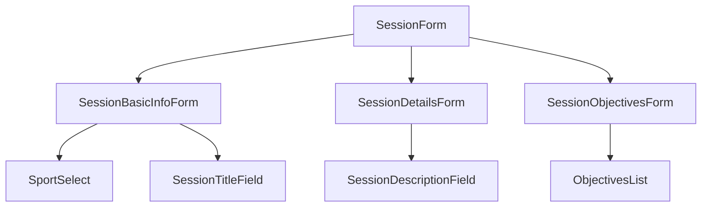

# Documentation des Sessions

## Exemple Pratique : Création d'une Séance

```typescript
// 1. Import des composants nécessaires
import { SessionForm } from "@/components/sessions/SessionForm";
import { useSessionMutation } from "@/hooks/mutations/useSessionMutation";

// 2. Configuration de base
const session = {
  title: "Entraînement Technique",
  objective: "Améliorer la technique individuelle",
  sport: "football",
  level: "debutant",
  duration: 60,
  participants: 12
};

// 3. Création de la séance
const { mutateAsync } = useSessionMutation();
await mutateAsync(session);
```

## Structure des Composants



## Points d'Attention
1. Validation des entrées utilisateur
2. Gestion des erreurs
3. Sauvegarde automatique
4. Performance avec données volumineuses

