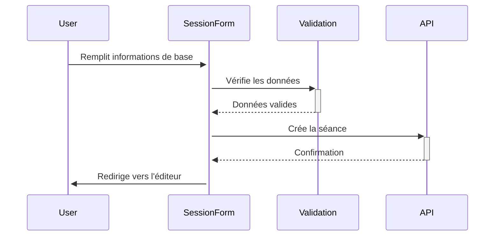

# Documentation des Sessions

## Vue d'ensemble
Le module de gestion des sessions est un composant central permettant la création et la gestion des séances d'entraînement.

## Architecture des Sessions

### Structure de données
```typescript
interface SessionData {
  title: string;               // Titre de la séance
  description: string;         // Description détaillée
  sport: string;              // Type de sport
  level: string;              // Niveau de difficulté
  duration: number;           // Durée en minutes
  participants_min: number;   // Nombre min de participants
  participants_max: number;   // Nombre max de participants
  age_category: string;       // Catégorie d'âge
  intensity_level: string;    // Niveau d'intensité
  objective: string;          // Objectif principal
  objectives: string[];       // Objectifs spécifiques
}
```

### Flux de création d'une séance


## Composants Principaux

### 1. SessionForm
Le formulaire principal de création/édition de séance.

#### Sous-composants
- `SessionBasicInfoForm` : Informations de base (titre, sport)
- `SessionDetailsForm` : Détails techniques (durée, niveau)
- `SessionParticipantsForm` : Gestion des participants
- `SessionObjectivesForm` : Configuration des objectifs

#### Example d'utilisation
```typescript
import { SessionForm } from "@/components/sessions/SessionForm";

const CreateSession = () => {
  return (
    <SessionForm
      onSave={(data) => console.log("Session saved:", data)}
      formData={initialData}
      setFormData={setFormData}
    />
  );
};
```

### 2. SequenceForm
Gestion des séquences d'une séance.

#### Fonctionnalités
- Ajout/suppression de séquences
- Réorganisation par drag & drop
- Configuration des exercices
- Gestion des objectifs spécifiques

#### Integration
```typescript
import { SequenceForm } from "@/components/sessions/SequenceForm";

const EditSession = () => {
  return (
    <SequenceForm
      sequences={sequences}
      onAddSequence={handleAdd}
      onReorderSequences={handleReorder}
      formData={sessionData}
    />
  );
};
```

## Workflows Principaux

### Création d'une nouvelle séance
1. Initialisation du formulaire
2. Validation des champs obligatoires
3. Sauvegarde dans la base de données
4. Redirection vers l'éditeur de séquences

### Modification d'une séance existante
1. Chargement des données existantes
2. Modification des champs
3. Validation des changements
4. Mise à jour en base de données

## Gestion des Erreurs

### Validation
- Vérification des champs obligatoires
- Validation des formats (durée, nombre de participants)
- Contrôle des valeurs autorisées

### Traitement des erreurs
```typescript
try {
  await saveSession(sessionData);
} catch (error) {
  console.error("Erreur lors de la sauvegarde:", error);
  // Affichage d'un message d'erreur à l'utilisateur
}
```

## Points d'Attention
1. **Performance**
   - Optimisation des requêtes
   - Gestion du cache
   - Lazy loading des composants lourds

2. **Sécurité**
   - Validation des entrées utilisateur
   - Protection CSRF
   - Gestion des permissions

3. **UX**
   - Feedback immédiat
   - Sauvegarde automatique
   - Navigation intuitive

## Tests

### Tests Unitaires
```typescript
describe("SessionForm", () => {
  it("should validate required fields", () => {
    // Implementation
  });

  it("should handle form submission", () => {
    // Implementation
  });
});
```

### Tests d'Intégration
- Vérification du flux complet
- Tests des interactions entre composants
- Validation des cas limites

## Future Améliorations
1. Support de templates personnalisés
2. Système de versions
3. Mode collaboration en temps réel
4. Export PDF des séances
