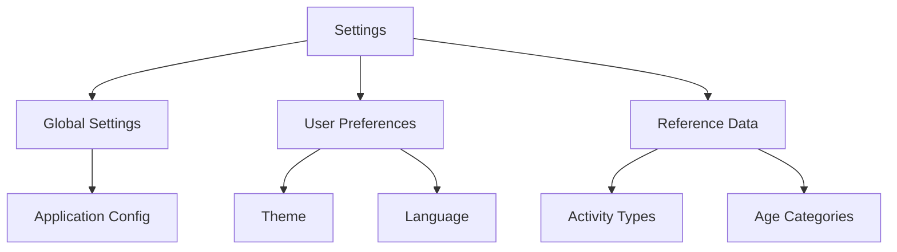

# Documentation des Paramètres

## Types de Paramètres

### 1. Paramètres Globaux
- Configuration de l'application
- Préférences utilisateur
- Thèmes et apparence

### 2. Paramètres de Séance
```typescript
interface SessionSettings {
  defaultDuration: number
  allowedSports: string[]
  maxParticipants: number
  intensityLevels: string[]
}
```

### 3. Catégories de Configuration
- Types d'activités
- Niveaux d'intensité
- Types de séquences
- Catégories d'âge

## Interface des Paramètres



## Gestion des Données

### 1. Structure de Stockage
```typescript
interface SettingsStore {
  theme: 'light' | 'dark'
  language: string
  notifications: boolean
  defaultValues: {
    duration: number
    sport: string
    level: string
  }
}
```

### 2. Persistance
- Stockage local
- Synchronisation avec le backend
- Gestion des conflits

## Points d'Attention
1. Validation des paramètres
2. Mise à jour en temps réel
3. Rétrocompatibilité
4. Performance
5. UX/UI cohérente

