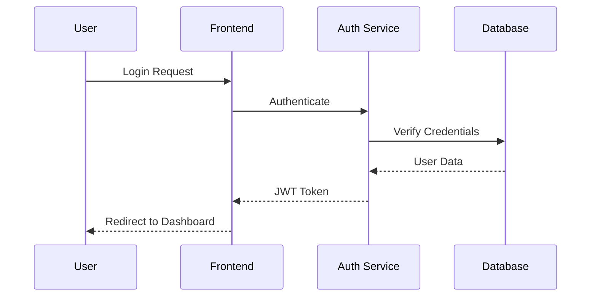
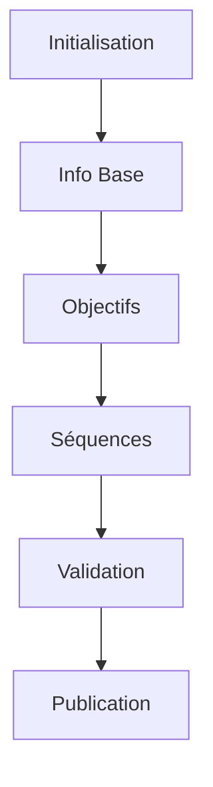
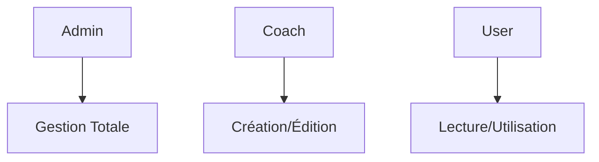
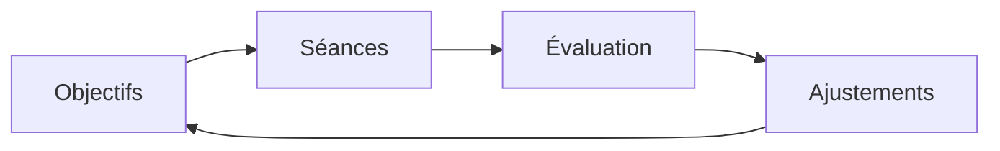
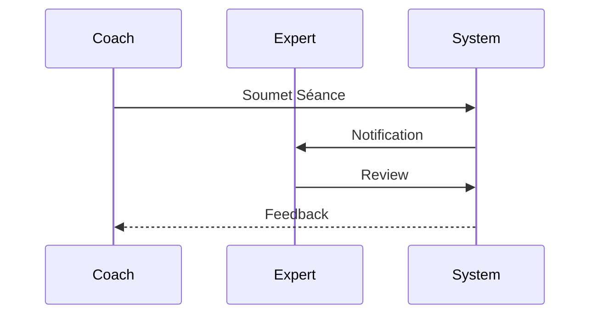

# Exigences Fonctionnelles - KAP

## 1. Gestion des Utilisateurs

### 1.1 Authentification
```typescript
interface AuthFeatures {
  login: boolean;              // Email/Password
  socialAuth: string[];        // ['Google', 'GitHub']
  mfa: boolean;               // Support 2FA
  passwordReset: boolean;      // Reset flow
}
```

#### Flux d'Authentification


### 1.2 Gestion de Profil
- Modification informations personnelles
- Préférences utilisateur
- Historique d'activité
- Statistiques d'utilisation

## 2. Gestion des Séances

### 2.1 Création de Séance
```typescript
interface SessionCreation {
  title: string;
  description: string;
  sport: string;
  level: string;
  duration: number;
  objectives: string[];
}
```

#### Workflow de Création


### 2.2 Gestion des Séquences
```typescript
interface Sequence {
  title: string;
  type: 'warmup' | 'main' | 'cooldown';
  duration: number;
  exercises: Exercise[];
  intensity: string;
}
```

#### Types de Séquences
1. **Échauffement**
   - Durée: 10-15 minutes
   - Intensité progressive
   - Exercices préparatoires

2. **Corps de Séance**
   - Exercices principaux
   - Situations tactiques
   - Progression technique

3. **Retour au calme**
   - Étirements
   - Récupération
   - Débriefing

## 3. Système de Templates

### 3.1 Gestion des Templates
```typescript
interface Template {
  id: string;
  name: string;
  sport: string;
  level: string;
  structure: TemplateStructure;
}
```

### 3.2 Personnalisation
- Adaptation au niveau
- Modification des exercices
- Ajustement des durées
- Configuration des objectifs

## 4. Collaboration et Partage

### 4.1 Fonctionnalités Sociales
```typescript
interface SocialFeatures {
  sharing: boolean;
  comments: boolean;
  likes: boolean;
  favorites: boolean;
}
```

### 4.2 Gestion des Droits


## 5. Gestion des Exercices

### 5.1 Bibliothèque d'Exercices
```typescript
interface Exercise {
  name: string;
  description: string;
  type: string;
  difficulty: number;
  equipment: string[];
  variations: string[];
}
```

### 5.2 Catégorisation
- Par sport
- Par niveau
- Par objectif
- Par équipement

## 6. Système d'Évaluation

### 6.1 Métriques de Performance
```typescript
interface Performance {
  completion: number;
  intensity: number;
  feedback: string;
  improvements: string[];
}
```

### 6.2 Suivi de Progression


## 7. Planification

### 7.1 Calendrier
- Vue hebdomadaire
- Vue mensuelle
- Récurrence
- Conflits

### 7.2 Cycles d'Entraînement
```typescript
interface TrainingCycle {
  startDate: Date;
  endDate: Date;
  objectives: string[];
  sessions: Session[];
}
```

## 8. Analytics et Reporting

### 8.1 Tableaux de Bord
```typescript
interface Dashboard {
  metrics: Metric[];
  charts: Chart[];
  kpis: KPI[];
  filters: Filter[];
}
```

### 8.2 Rapports
- Performance individuelle
- Statistiques de groupe
- Tendances
- Recommandations

## 9. Configuration Système

### 9.1 Paramètres Globaux
```typescript
interface SystemConfig {
  languages: string[];
  timeZones: string[];
  units: string[];
  features: Feature[];
}
```

### 9.2 Personnalisation
- Thèmes
- Notifications
- Préférences d'affichage
- Raccourcis

## 10. Validation Expert

### 10.1 Processus de Validation


### 10.2 Critères
```typescript
interface ValidationCriteria {
  safety: boolean;
  effectiveness: boolean;
  progression: boolean;
  methodology: boolean;
}
```

## 11. Système de Notifications

### 11.1 Types de Notifications
```typescript
interface Notification {
  type: 'info' | 'warning' | 'success' | 'error';
  message: string;
  action?: () => void;
  duration?: number;
}
```

### 11.2 Canaux
- In-app
- Email
- Push mobile
- SMS

## 12. Import/Export

### 12.1 Formats Supportés
- PDF
- Excel
- JSON
- Video

### 12.2 Intégrations
- Calendriers externes
- Plateformes fitness
- Réseaux sociaux
- Apps sportives
