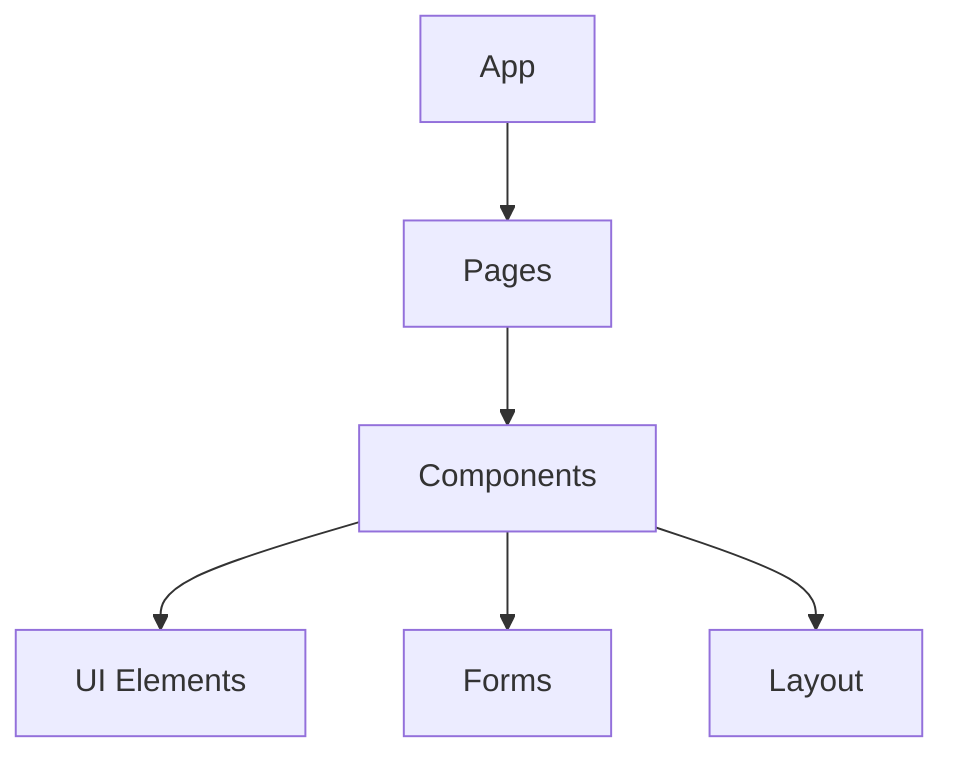

# Guide du Développement KAP

## 1. Configuration du Projet

### 1.1 Prérequis
```bash
node >= 16.0.0
npm >= 7.0.0
git
```

### 1.2 Installation
```bash
# Cloner le repo
git clone https://github.com/votre-org/kap.git

# Installer les dépendances
cd kap
npm install

# Variables d'environnement
cp .env.example .env.local
```

## 2. Architecture

### 2.1 Structure des Dossiers
```
src/
├── components/       # Composants React
├── hooks/           # Hooks personnalisés
├── pages/           # Pages de l'application
├── utils/           # Utilitaires
├── types/           # Types TypeScript
├── api/             # Intégration API
└── styles/          # Styles Tailwind
```

### 2.2 Composants Principaux


## 3. Développement

### 3.1 Commandes Principales
```bash
# Développement
npm run dev

# Tests
npm run test

# Build
npm run build

# Lint
npm run lint
```

### 3.2 Standards de Code
```typescript
// Exemple de composant
interface Props {
  title: string;
  onAction: () => void;
}

export const Component = ({ title, onAction }: Props) => {
  return (
    <div className="p-4">
      <h1>{title}</h1>
      <button onClick={onAction}>
        Action
      </button>
    </div>
  );
};
```

## 4. Intégration Supabase

### 4.1 Configuration
```typescript
import { createClient } from '@supabase/supabase-js'

export const supabase = createClient(
  process.env.NEXT_PUBLIC_SUPABASE_URL!,
  process.env.NEXT_PUBLIC_SUPABASE_ANON_KEY!
)
```

### 4.2 Exemple d'Utilisation
```typescript
// Récupération de données
const { data, error } = await supabase
  .from('sessions')
  .select('*')
  .eq('user_id', userId)
```

## 5. Tests

### 5.1 Tests Unitaires
```typescript
import { render, screen } from '@testing-library/react'
import { Component } from './Component'

describe('Component', () => {
  it('renders correctly', () => {
    render(<Component title="Test" onAction={() => {}} />)
    expect(screen.getByText('Test')).toBeInTheDocument()
  })
})
```

### 5.2 Tests d'Intégration
```typescript
describe('API Integration', () => {
  it('fetches data correctly', async () => {
    const data = await fetchData()
    expect(data).toBeDefined()
  })
})
```

## 6. State Management

### 6.1 React Query
```typescript
import { useQuery, useMutation } from '@tanstack/react-query'

// Query
const { data } = useQuery({
  queryKey: ['sessions'],
  queryFn: fetchSessions
})

//